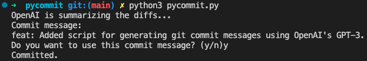

## PyCommit

#### A tiny toy, it might helps you write better commit messages.

PyCommit is a tiny toy that helps developers write better commit messages. It uses OpenAI to generate commit messages that are clear and concise.

#### How to use PyCommit

* Set the `OPENAI_API_KEY` environment variable in your shell.

* Make some changes to your project.

* Run `python3 pycommit.py` to use OpenAI to generate a commit message.

* Review the generated commit message and make any necessary changes.

* Commit your changes with the generated commit message.

#### Installation

Clone the repository.

Install the dependencies with `pip3 install -r requirements.txt`.

#### Configuration

Set the `OPENAI_API_KEY` environment variable in your shell.

#### Contributing

Fork the repository.

Create a new branch for your feature.

Make your changes.

Write tests for your changes.

Run the tests with pytest.

Submit a pull request.

#### License

This project is licensed under the MIT License. See the LICENSE file for details.
